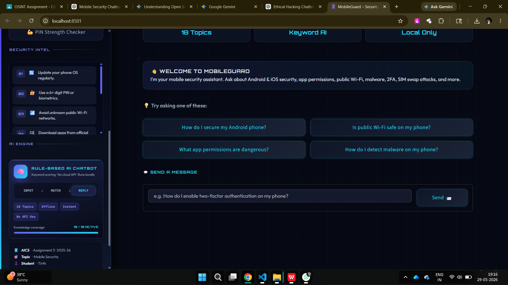
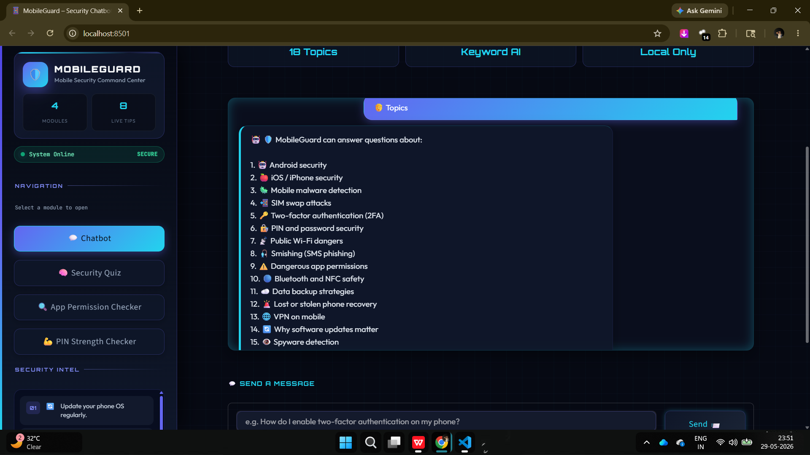
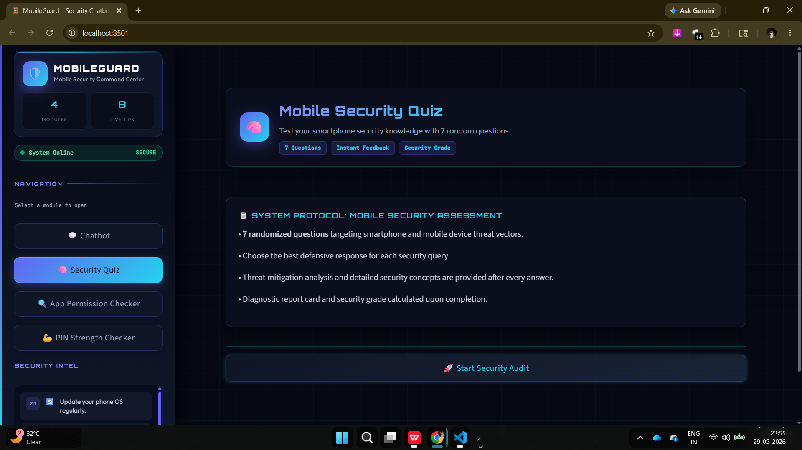
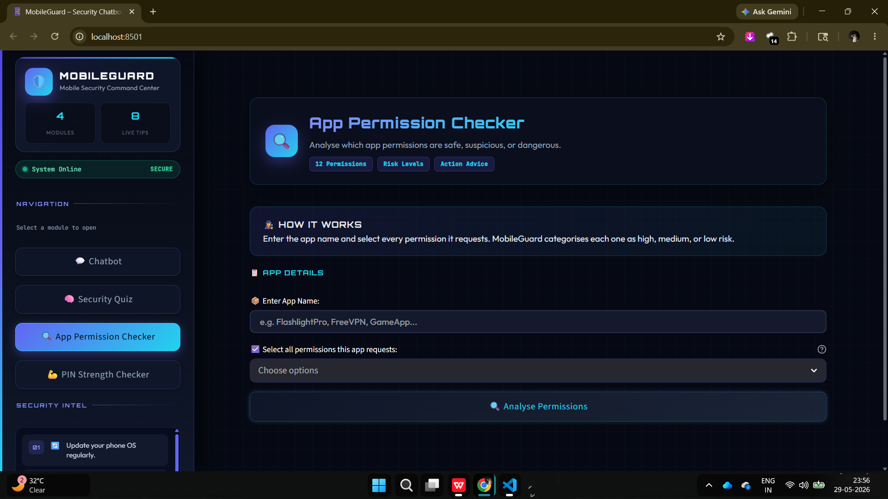
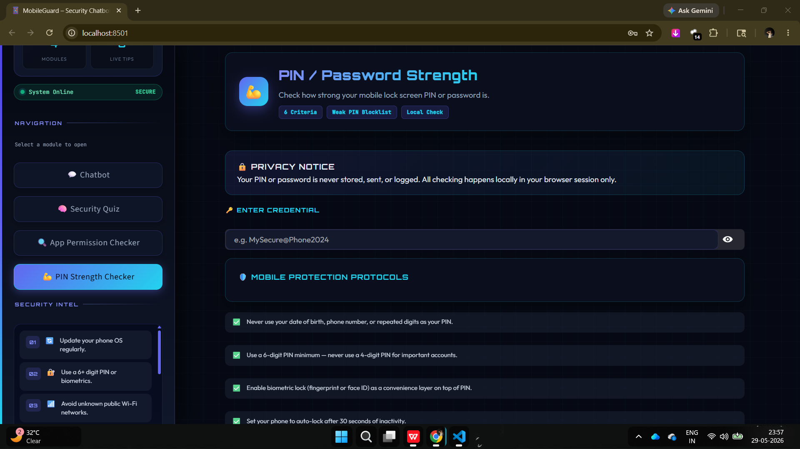

# 📱 MobileGuard — AI-Powered Mobile Security Chatbot

<div align="center">



[](https://python.org)
[](https://streamlit.io)
[](LICENSE)
[]()
[](https://claude.ai)

**An AI-powered cybersecurity chatbot that educates users about smartphone & mobile security threats.**

*AICS Assignment 3 | Department of Computer Science & Cybersecurity | 2025-26*

[🚀 Features](#-features) • [📸 Screenshots](#-screenshots) • [⚙️ Installation](#️-installation) • [💬 Usage](#-usage) • [🛡️ Topics](#️-cybersecurity-topics-covered) • [🎓 Viva Ready](#-viva-ready)

</div>

---

## 🌟 About The Project

**MobileGuard** is a rule-based AI chatbot built with **Python + Streamlit** that acts as a personal mobile cybersecurity assistant. It helps everyday smartphone users understand real-world threats — from SIM swap attacks to dangerous app permissions — and provides actionable protection advice.

> 🎯 **Assignment:** AICS (AI in Cybersecurity) — Assignment 3
> 👤 **Student:** Tirth | Enrollment: 25004403410012
> 🏫 **Topic:** Mobile Security Chatbot — Smartphone & iOS Security

---

## ✨ Features

| Module | Description |
|--------|-------------|
| 💬 **AI Chatbot** | 19 mobile security topics with keyword-scoring response engine |
| 🧠 **Security Quiz** | 10 questions, 7 shown randomly per session with instant feedback |
| 🔍 **App Permission Checker** | Analyses 12 permissions and rates them HIGH / MEDIUM / LOW risk |
| 💪 **PIN Strength Checker** | 6-criteria scoring with visual strength bar and weak PIN blacklist |
| ⚡ **Security Intel Sidebar** | 8 live security tips always visible across all modules |
| 🌙 **Dark Cyber Theme** | Professional dark navy UI with electric blue accents |

---

## 📸 Screenshots

### 💬 Chatbot — Welcome Screen


### 💬 Chatbot — Topics & Responses


### 🧠 Security Quiz


### 🔍 App Permission Checker


### 💪 PIN Strength Checker


---

## ⚙️ Installation

### Prerequisites
- Python 3.x installed → [python.org](https://python.org)
- pip package manager

### Steps

```bash
# 1. Clone the repository
git clone https://github.com/YOUR_USERNAME/MobileGuard-Cybersecurity-Chatbot.git

# 2. Navigate into the project folder
cd MobileGuard-Cybersecurity-Chatbot

# 3. Install dependencies
pip install -r requirements.txt

# 4. Run the chatbot
streamlit run app.py
```

The app opens automatically at **http://localhost:8501** 🚀

---

## 💬 Usage

Once the app is running:

1. **Chatbot** — Type any mobile security question (e.g. *"What is a SIM swap attack?"*)
2. **Security Quiz** — Click `🚀 Start Security Audit` to test your knowledge
3. **App Permission Checker** — Enter an app name, select its permissions, click Analyse
4. **PIN Checker** — Enter your phone PIN/password to check its strength

---

## 🛡️ Cybersecurity Topics Covered

```
📱 Android Security          🍎 iOS / iPhone Security
🦠 Mobile Malware Detection  📲 SIM Swap Attacks
🔑 2FA & OTP Security        🔏 PIN & Password Security
📡 Public Wi-Fi Dangers      🎣 Smishing (SMS Phishing)
⚠️  Dangerous App Permissions 🔵 Bluetooth & NFC Safety
☁️  Data Backup Strategies    🚨 Stolen Phone Recovery
🌐 VPN on Mobile             🔄 Software Update Importance
👁️  Spyware Detection
```

---

## 🧠 How The Chatbot Works

```
User Input
    ↓
Convert to lowercase
    ↓
Check: Greeting? Thanks? Help?
    ↓
Keyword Scoring Engine
    (For each of 19 knowledge base entries:
     count how many keywords match user input)
    ↓
Return highest-scoring response
    ↓
If score = 0 → Random helpful fallback message
```

**Why Keyword Scoring?**
More flexible than `if/elif` chains — finds the BEST match by scoring all entries, not just the first match.

---

## 📁 Project Structure

```
MobileGuard-Cybersecurity-Chatbot/
│
├── app.py              ← Main Streamlit UI (4 pages + dark CSS + routing)
├── chatbot.py          ← Knowledge base (19 topics) + response engine
├── quiz.py             ← 10 quiz questions with explanations
├── requirements.txt    ← Python dependencies
├── README.md           ← This file
│
└── screenshots/
    ├── CB1.png         ← Chatbot welcome screen
    ├── CB2.png         ← Chatbot topics list
    ├── CB3.png         ← Chatbot in conversation
    ├── CB4.png         ← Chatbot response example
    ├── SQ.png          ← Security Quiz
    ├── APC.png         ← App Permission Checker
    ├── PS.png          ← PIN Strength Checker
    └── SI.png          ← Security Intel sidebar
```

---

## 🛠️ Built With

| Technology | Purpose |
|-----------|---------|
| **Python 3.x** | Core programming language |
| **Streamlit** | Web UI framework |
| **re (Regex)** | PIN pattern matching |
| **random** | Quiz shuffling + fallback rotation |
| **Claude AI** | Coding assistance (allowed per assignment rules) |

---

## 🎓 Viva Ready

<details>
<summary><b>Click to see key viva Q&A</b></summary>

**Q: Is this rule-based or AI-based?**
> Rule-based chatbot using keyword scoring. Claude AI was used as a coding tool, not as the chatbot engine.

**Q: How does get_response() work?**
> Converts input to lowercase → loops through all 19 knowledge base entries → counts keyword matches → returns the highest-scoring response → falls back to a helpful message if nothing matches.

**Q: Why Streamlit?**
> Builds interactive web apps in pure Python — no HTML/CSS/JS needed. Recommended in assignment guidelines.

**Q: What is session_state?**
> Streamlit reruns the entire script on every interaction. session_state preserves variables (chat history, quiz score) between reruns.

**Q: Limitations?**
> Cannot understand complex sentences, no memory between sessions, responses are pre-written.

**Q: Future improvements?**
> Integrate Gemini/OpenAI API, add NLP for intent detection, add database for chat history.

</details>

---

## 📋 Assignment Checklist

- ✅ Minimum 10 Q&A pairs (19 topics delivered)
- ✅ Sidebar with security tips
- ✅ Welcome screen
- ✅ Custom theme matching mobile security
- ✅ PIN/Password checker
- ✅ Quiz feature
- ✅ Error handling / fallback responses
- ✅ Minimum 5 screenshots (8 screenshots delivered)
- ✅ Demo video recorded
- ✅ Word document report

---

## 👤 Author

**Tirth**
- Enrollment: 25004403410012
- Department of Computer Science & Cybersecurity
- Academic Year: 2025-26

---

<div align="center">

⭐ **If you found this project helpful, please give it a star!** ⭐

*Built with 💙 using Python + Streamlit + Claude AI*

</div>
